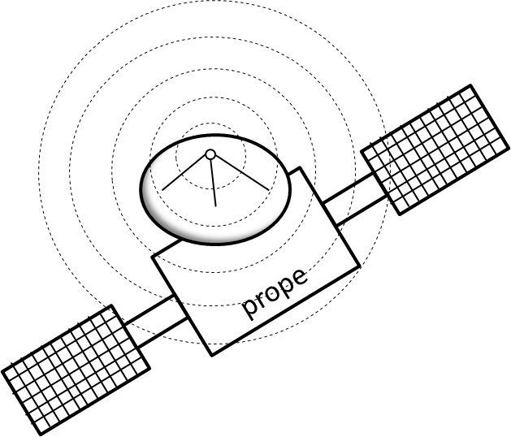

# prope 


PROcess-aware information systems Portability mEtrics suite 

[](https://travis-ci.org/uniba-dsg/prope)
[](https://www.versioneye.com/user/projects/53b3bf930d5bb8091c00001a)
[](https://coveralls.io/r/uniba-dsg/prope?branch=master)

Prope is a static analyzer that _probes_ for portability issues in process code and highlights these issues by computing portability metrics for a process.
It can analyze a variety of artifacts, most notably processes written in BPMN 2.0 and BPEL 2.0. It can also analyze deployment archives and log files.

## Quality Characteristics
Prope computes portability metrics aligned to the ISO/IEC 25010 Systems and software Quality Requirements and Evaluation (SQuaRE) method. This includes the following quality characteristics:

| Quality Characteristic     | Status (package)          | 
| ------------- |-------------| 
| Direct code portability      | implemented (`prope.metrics.portability`)| 
| Installability     | implemented (`prope.metrics.installability`) | 
| Adaptability      | implemented (`prope.metrics.adaptability`)| 

## Software Requirements
Prope uses the gradle wrapper, so anything besides Java will be downloaded and installed automatically.
- JDK 1.8.X
  - `JAVA_HOME` should point to the jdk directory
  - `PATH` should include `JAVA_HOME/bin`
  
## Licensing
[MIT license](http://opensource.org/licenses/MIT)

## Usage
Prope can be executed using OS dependent start scripts. It can be built, but also executed using gradle.
```bash
$ prope "<ARGS>"
# usage: <metric-option> <path-to-files>

# alternatively
$ gradlew run -Pargs="<ARGS>"

```

`<metric-option>`: Prope allows for the computation of various types of metrics and the files to be analyzed depend on that type. For that reason, the type of metrics to be computed must be stated on execution. Following options are implemented so far:
* `p`: prope computes direct portability metrics, such as weighted elements portability or activity portability, for process files
* `d`: prope computes deployability metrics, such as deployment descriptor size or effort of package construction, for deployment archives
* `i`: prope computes installability metrics for process engines, such as average installation time or installation effort
* `a`: prope computes adaptability metrics for processes, such as binary or weighted adaptability

`<path-to-files>`: Prope parses single files or recursively traverses directory structures, looking for relevant files. Everything that is analyzed in an execution run is aggregated to a result set and written to CSV files, ready to be consumed by MS Excel or R. Prope is forgiving: It tries to analyze as many files as possible, sometimes depending on the type, but if the analysis for a file fails or nothing relevant is found, that file is just ignored.

```bash
# Examples
# Compute portability metrics for a process from the test directory
$ prope -p src/test/resources/portability/Invoke-Empty.bpel 
# Compute installability metrics from all files of a specific test directory 
$ prope -i src/test/resources/installability/server 
# Compute deployability metrics from all files of a specific test directory 
$ prope -d src/test/resources/installability/deployment 
# Compute adaptability metrics from all files of a specific test directory 
$ prope -a src/test/resources/adaptability 
```
Prope comes with tasks for generation IntelliJ and Eclipse project files
```bash
# Generate project files 
$ gradlew idea # Generates Intellij IDEA project files
$ gradlew eclipse # Generates Eclipse project files

# Manually purge temporary files
$ gradlew deleteTmpDir # purge temporary files manually
```

## Output

Prope produces two different files that are written to the root directory and can be analyzed by statistical tooling:
- `results.csv`: A list of all metrics of the selected type and their values for the files analyzed. Values are separated with a semicolon.
- `raw.csv`: A list of raw data from which several metrics of the above metrics can be computed. Values are separated with a semicolon.

## Project Structure

| Package     | Purpose          | 
| ------------- |-------------| 
| `src/main/java `     | the main source code| 
| `src/main/java/prope/executables`     | classes that implement the main workflow, such as traversing a directory structure and triggering the metrics computation and reporting | 
| `src/main/java/prope/metrics/adaptability`     | classes for computing adaptability metrics| 
| `src/main/java/prope/metrics/installability`     | classes for computing installability metrics| 
| `src/main/java/prope/metrics/portability`     | classes for computing portability metrics| 
| `src/main/java/prope/reporting`     | classes for writing reports and result files to the file system| 
| `src/main/r`     | scripts written in R that consume the CSV file produced by pete and perform several simple analyses of the data| 
| `src/test/java`     | JUnit tests for prope| 
| `src/test/resources`     | files that are analyzed during the unit tests| 

## Authors 

[Joerg Lenhard](https://joerglenhard.wordpress.com/)

## Contribution Guide
Contribution is appreciated! Feel free to open issues. Apart from that, the normal git workflow applies:

- Fork
- Send Pull Request
